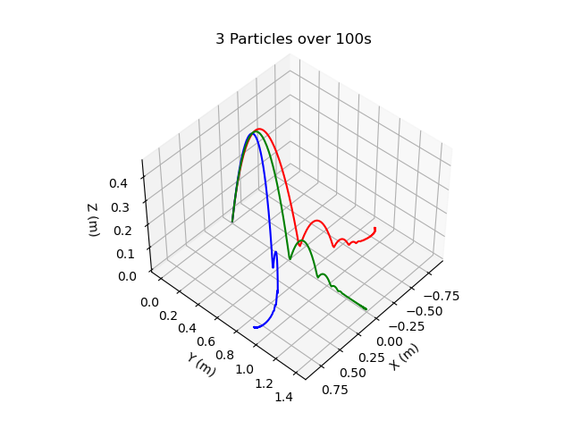
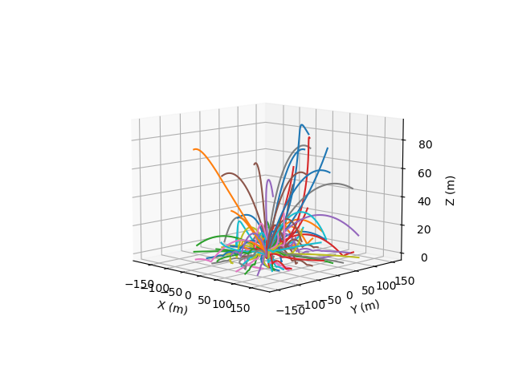

# Nano-Particle-Playground

This project represents a simple particle simulation framework in Python, designed to simulate the behavior of particles under various forces. It uses a basic simulation loop to update the positions and velocities of particles over time.

<p align="center">
  
   
</p>


## Contents
```
├── src/
│   └── Forces.py
│   └── Simulation.py
│   └── Particle.py
|   └── ParticleGeneration.py
├── tests/
    └── ...
└── main.py
```

- [Simulation.py](src/Simulation.py): Contains the main simulation class (`Simulation`) responsible for updating particles and applying forces.
- [Particle.py](src/Particle.py): Defines the `Particle` class, which represents individual particles in the simulation.
- [ParticleGeneration.py](src/ParticleGenerator.py): Helper functions to generate specific groups of Particles.
- [Forces.py](src/Forces.py): Contains force-related classes like `Gravity` and `Damping`.
- [main.py](main.py): A sample script that demonstrates how to use the simulation framework by creating particles, applying forces, and updating the simulation.

## Prerequisites
Make sure you have the following prerequisites installed:

- Python
- NumPy
- Matplotlib

You can install these packages using pip if they are not already installed:

``` bash
pip install numpy matplotlib
```

## Usage

To use the particle simulation framework:

1. Import the required classes from the respective files (`Simulation`, `Particle`, and `Forces`).
2. Create particles, specify their initial properties (position, velocity, mass), and add them to the simulation.
3. Add forces (e.g., gravity, damping) to the simulation.
4. Use the `Update` method of the `Simulation` class to advance the simulation over time.
5. View information about the system, such as kinetic and potential energy, using the `Display` method.
6. View a 3d plot of the particle's tragectories with the `Plot` method.

Feel free to customize and extend the simulation for your specific use case.

To run the particle simulation:
```bash
python src/main.py
```

To run the Streamlit app:
```bash
streamlit run streamlit.py
```

## Running Tests
To run the tests for this project, you will need to have pytest installed. If you haven't installed it yet, you can do so using pip:

```bash
pip install pytest
```
Once pytest is installed, you can run the tests using the following command:

```bash
pytest test_forces.py
```

This command will execute the tests in the test_forces.py file, which contains test cases for the force classes used in the simulation. Make sure you are in the project's root directory when running the tests.

The tests cover various aspects of the Simulation application, ensuring it behaves as expected. You can explore the [test files](tests/) to see the specific test cases and assertions.

## Examples



Here's a basic example using the simulation framework:

### Enviromment setup

Import the library functions and initalise the simulation

```python
from Simulation import *
from Particle import *
from Forces import *

# Create a simulation
sim = Simulation()

# Add gravity force to the simulation
sim.Forces.append(Gravity())
```
Other forces can be added to the simulation, define them in the [Froces.py](Forces.py)

### Creating particles
Create the particles and add them to the simulation. Define each particles postion, velocities and mass.
```python
p1 = Particle([2, 1, 2], [0.3, -0.4, 28], 1)
p2 = Particle([1.5, 1.1, 2], [0.1, 0.1, 33], 1)
p3 = Particle([3, 2, 2], [0.2, 0.5, 29], 1)

sim.AddParticles([p1, p2, p3])
```

### Adding the forces
Use Forces to define the rules of motion that the particels must follow
```python
grav = Gravity()

sim.AddForce([grav])
```

### Running the Simulation
The `Run` method runs the simulation, taking 2 paramaters:

- duration (float): The total duration of the simulation in seconds.
- timeStep (float): The time step (seconds) at which the simulation is updated.
- saveHistory (boolean) (optional): Controls if the positional history of the particles is saved.
```python
duration = 5 # total simulation time of 5s
timeStep = 0.01 # updates will be calcuated at 0.01 time invervals

sim.Run(duration, timeStep)
```

### Plotting the results
There are several methods that will visually display that results of the simulaiton. These plot methods can be called at any time, even if future `sim.Run()` events are to occur.

- Plot: Plots a 2d axis with the positon of the particles
- PlotPaths: Plots a 3D axis with the paths for each particle from the simulation. (Requires particle history to be saved during `sim.Run()` events)
- PlotHistogram: Plots a histogram of particle's displacment from the origin.

```python
sim.Plot()

sim.PlotPaths()

sim.PlotHistogram()
```

## License
This project is available under the MIT License. See the [LICENSE](LICENSE) file for more details.

